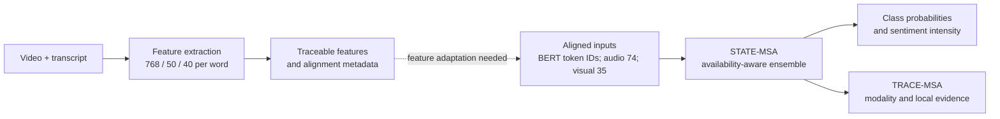

# Robust Multimodal Sentiment

**Sentiment prediction and evidence analysis when text, audio, or visual observations are incomplete.**

This research codebase explores two connected questions: how to predict sentiment from the modalities that are available, and how to inspect the model's evidence at modality and token levels. It contains a missing-aware predictor (**STATE-MSA**), an explanation layer (**TRACE-MSA**), and a separate pipeline for traceable feature extraction from video.

[Architecture](#architecture) · [Results](#recorded-results) · [Get started](#get-started) · [Data contracts](docs/data-contracts.md) · [中文概览](#中文概览)

## What is in the project

| Component | What it does | Start here |
| --- | --- | --- |
| **STATE-MSA** | Reads aligned text, audio, and visual features; uses availability masks for three-class sentiment and continuous intensity prediction | [`sentiment_model/`](sentiment_model/) |
| **TRACE-MSA** | Explains a frozen STATE-MSA ensemble with three-modality Shapley values, local window deletion, and optional source-time mapping | [`explainability/`](explainability/) |
| **Feature extraction** | Extracts word-level text, acoustic, and facial descriptors from video and records alignment quality | [`feature_extraction/`](feature_extraction/) |

### Design ideas

- **Availability is part of the input.** A missing modality is represented by a mask; zero-filled storage is not interpreted as a measured neutral signal.
- **Evidence stays inspectable.** TRACE-MSA reports signed modality effects and local changes in prediction when short observed spans are removed.
- **Uncertain alignment is visible.** The extraction pipeline records quality and availability, and source-time mappings remain approximate until reviewed.

## Architecture



The two feature paths have **different contracts**. STATE-MSA and TRACE-MSA operate on an existing 50-position aligned dataset with 74-dimensional audio and 35-dimensional visual features. The video extraction module produces 50-dimensional audio and 40-dimensional visual features per word. Its output is useful for extraction and traceability research, but it cannot be fed directly to the current predictor. The fields and shapes are in [Data contracts](docs/data-contracts.md).

## Recorded results

The original experiment record reports the following values on a 728-sample validation split:

| Evaluation | Accuracy | Macro-F1 | MAE |
| --- | ---: | ---: | ---: |
| Complete input | 0.6429 | 0.6279 | 0.5660 |
| Mean of 54 controlled missing-modality conditions | 0.6135 | 0.5981 | 0.5917 |

These are **author-recorded validation results**, not independently rerun results from this public repository. The data, trained checkpoints, fitted scalers, and pretrained BERT weights are not distributed here. The 54 conditions are controlled masking tests; they do not cover every real-world reason a modality may be missing. See [Evaluation notes](docs/evaluation.md) for the setup and limits.

## Get started

The components keep separate environments because feature extraction and model training have different dependencies. Python 3.12 and [`uv`](https://docs.astral.sh/uv/) are used for the two locked environments.

### Explore the model code

```bash
cd sentiment_model
uv sync --locked
PYTHONPATH=src uv run --no-sync python -m q2.run --help
```

To train or evaluate, supply a compatible `aligned_50.pkl` dataset and local `bert-base-uncased` weights. The dataset is a trusted Pickle file with `train`, `valid`, and `test` splits. Inputs and commands are in the [model guide](sentiment_model/README.md).

### Explore the explanation code

```bash
cd explainability
../sentiment_model/.venv/bin/python -m src.q3.run --help
```

Full inference requires three compatible STATE-MSA checkpoints, their fitted scalers, the same BERT weights, and aligned samples. Optional video time mapping also needs the extraction dependencies. See the [explanation guide](explainability/README.md).

### Extract features from video

The [feature extraction guide](feature_extraction/README.md) covers FFmpeg, OpenFace, pretrained assets, input layout, and quality review. Its output schema is separate from the model input schema above.

## Repository layout

```text
feature_extraction/  Video-to-word features, alignment, and quality review
sentiment_model/    STATE-MSA model, masks, training, evaluation, and experiment scripts
explainability/     TRACE-MSA attribution, evidence reporting, and source mapping
docs/               Method, data contracts, and evaluation notes
```

The Python entry points retain some `q1`, `q2`, `q3`, and `attachment` names from the original research run. These names identify the supported input and output contracts; the top-level organization follows the reusable project components. TRACE-MSA loads model and extraction helpers from the sibling directories without duplicate source trees.

## Related projects

[MMSA](https://github.com/thuiar/MMSA) is a broader multimodal sentiment analysis framework with model and dataset APIs. [CMU-MultimodalSDK](https://github.com/CMU-MultiComp-Lab/CMU-MultimodalSDK) provides tooling for multimodal datasets and sequence alignment. Their clear module guides and data documentation informed this repository's presentation; the code here is a separate research implementation.

## Project status and reuse

This is a research code release, not a packaged inference service. Reproducing the recorded results requires authorized access to the original data and compatible model assets. Load Pickle files and PyTorch checkpoints only from trusted sources. The repository currently has no license; contact the author before reuse.

The work began as a 2026 mathematical modeling project. The public repository presents its methods and code as a research project; dataset access and evaluation remain tied to the original experimental setup.

## 中文概览

本项目研究文本、语音和视觉信息不完整时的情感识别与模型解释。`sentiment_model/` 是带可用性掩码的 STATE-MSA 预测模型；`explainability/` 是对冻结模型进行模态归因和局部证据分析的 TRACE-MSA；`feature_extraction/` 提供可追溯的词级特征抽取与对齐。

视频抽取模块与预测模型使用**不同的音视频特征维度**，目前不能直接串联。仓库不包含原始数据、模型权重或预测结果；表格数值来自原项目的验证记录，本次整理没有重新训练或复算。
