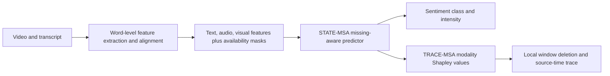

# Robust Multimodal Sentiment under Missing Observations

**A three-stage research project for multimodal sentiment prediction when text, audio, or visual evidence is incomplete.**

[中文简介](#中文简介) · [Method](#method-at-a-glance) · [Repository](#repository-map) · [Reproducibility](#reproducibility)

This project was developed for a 2026 mathematical modeling challenge on multimodal sentiment analysis. It studies a practical question: **how should a sentiment model make predictions when one or more modalities are unavailable, and how can its evidence be traced back to the source?**

The pipeline connects word-level feature extraction, missing-aware prediction, and post-hoc evidence analysis. Its central modeling view is to condition on both the observed features and their availability:

$$
P(Y \mid X_{\mathrm{observed}}, A),
$$

where $A$ records which modalities are available. This helps distinguish an unavailable modality from a measured neutral signal.

## Method at a glance



### Q1 · Word-level feature pipeline

- Uses the supplied transcript as the text reference and extracts BERT token representations.
- Extracts acoustic and facial-behavior signals from the media, then aggregates frame-level observations into word-level features.
- Records alignment quality and modality availability explicitly. Unreliable alignment stays unavailable instead of being silently treated as valid evidence.

### Q2 · STATE-MSA

- Predicts negative, neutral, or positive sentiment and a continuous sentiment intensity.
- Trains with modality-availability masks to examine partial-observation conditions.
- Uses an ensemble of three random seeds and a conditional regression head for intensity.

### Q3 · TRACE-MSA

- Keeps the Q2 predictor frozen while explaining its predictions.
- Computes exact Shapley values over the three modalities for the predicted-class log-odds.
- Measures local evidence by deleting short contiguous token windows, then maps supported positions back to transcript and approximate media time when alignment permits.

## Validation snapshot

The existing project records a validation run on 728 examples. The values below are reported from that run; they have not been independently rerun as part of preparing this showcase repository.

| Setting | Accuracy | Macro-F1 | MAE |
| --- | ---: | ---: | ---: |
| Clean validation | 0.6429 | 0.6279 | 0.5660 |
| Mean over 54 partial-modality conditions | 0.6135 | 0.5981 | 0.5917 |

These numbers describe one project configuration and data split. They are not a claim of state-of-the-art performance. The challenge data, fitted scalers, and model checkpoints are not included here, so this repository alone cannot reproduce the values.

## Repository map

| Path | Contents |
| --- | --- |
| [`q1/`](q1/) | Feature extraction, temporal alignment, quality policy, and aggregation code |
| [`q2/`](q2/) | STATE-MSA model, missing-modality handling, training and evaluation scripts |
| [`q3/`](q3/) | TRACE-MSA attribution, local evidence analysis, and source-time mapping |
| [`docs/method.md`](docs/method.md) | Concise method notes and design decisions |

The three stages retain separate Python environments because their dependencies differ. Q3 vendors small source subsets from Q1 and Q2 so that its attribution code can load the same predictor and alignment helpers; these are project source copies, not third-party repositories.

## Reproducibility

Each stage has its own environment declaration and command-line entry points. Start in the corresponding directory:

```bash
# Q1 environment
cd q1
uv sync --locked --python 3.12
uv run --no-sync python -m unittest discover -s tests -v

# Q2 environment (after supplying the required data and model assets)
cd ../q2
uv sync --locked
PYTHONPATH=src .venv/bin/python -m unittest discover -s tests -v
```

Q1 additionally requires FFmpeg/FFprobe, OpenFace 2.2.0 and the referenced pretrained alignment assets. Q2 and Q3 require the challenge feature files, a compatible `bert-base-uncased` checkpoint, and trained model checkpoints. Q3's CLI and asset requirements are documented by:

```bash
cd ../q3
python -m src.q3.run --help
```

Input datasets, pretrained weights, fitted scalers, competition predictions, and generated outputs are intentionally not included. Obtain data and model assets from their authorized sources, verify their provenance, and follow their licenses and access terms. Pickle and PyTorch checkpoint files should only be loaded when trusted.

## Scope and limitations

- The project evaluates defined missing-modality conditions; these do not establish robustness to every real-world missingness mechanism.
- A zero-filled feature vector is only a storage placeholder. It does not mean the corresponding signal was observed as neutral.
- Time mappings from automatic alignment are approximate. An attribution score is a model explanation, not proof of human causal reasoning.
- Results depend on the challenge data, feature extraction, pretrained assets, and the recorded model configuration.
- This repository has no license file. Reuse is not granted; contact the author for permission.

## 中文简介

本项目针对多模态情感识别中的模态缺失问题，整理了三阶段方案：Q1 从视频与文本提取并对齐词级特征；Q2 使用可用性掩码训练情感分类与强度预测模型；Q3 通过三模态 Shapley 归因、局部窗口删除和时间回溯解释模型输出。

仓库仅保留代码与方法说明，不包含比赛数据、预训练权重、训练检查点、拟合的标准化参数、预测结果或生成图表。README 中的验证数值来自已有项目记录，本次整理未重新运行。
