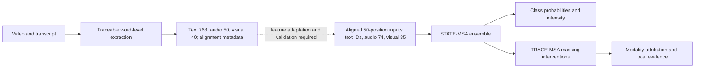

# Robust Multimodal Sentiment

Robust Multimodal Sentiment studies how to predict sentiment when text, audio,
or visual observations are incomplete, and how to inspect the evidence used by
a frozen predictor. **STATE-MSA** predicts three-class sentiment and continuous
intensity; **TRACE-MSA** analyzes modality contributions and local evidence.
A separate video pipeline extracts traceable word-level features.

This is a standalone research code and documentation release. Original datasets,
media, numerical predictions, explanation records, pretrained weights and trained
checkpoints remain external. CPU utilities support synthetic contract checks and
optional re-scoring of separately supplied private records.

Start with [how it works](#how-it-works), the [experimental workflow](#experimental-workflow),
or the [CPU quick start](#quick-start). [中文说明](README.zh.md).

## How it works

A missing observation should not be interpreted as measured neutrality.
STATE-MSA separates valid content from available observations, replaces missing
text before BERT encoding, and masks unavailable audio/visual positions during
fusion. The recorded predictor uses a frozen BERT encoder, an M4 availability-aware
backbone, and a conditional two-regime intensity head. Its three seeds are
3407, 42 and 2026. Class probabilities and clipped intensities are averaged
independently across seeds.

TRACE-MSA evaluates all eight subsets of the three modalities for exact Shapley
attribution. It measures signed effects on the predicted class's log-odds and on
intensity, then deletes short windows to inspect local sensitivity. Optional
transcript/video mapping links positions to approximate source times.



**The two feature paths have different contracts.** Video extraction produces
50-dimensional audio and 40-dimensional visual features per word. The predictor
expects 74/35-dimensional features at 50 aligned positions. These paths cannot
be directly connected by padding or resampling. See [data contracts](docs/data-contracts.md)
and [method](docs/method.md).

## Experimental workflow

1. **Audit the aligned data.** Validate the field-major train/valid/test layout,
   derive content and availability masks, and fit audio/visual scaling only on
   observed training positions.
2. **Train three independent M4 backbones.** Keep BERT frozen, apply mixed
   missingness during training, and select checkpoints using clean validation
   plus six predetermined representative masking conditions.
3. **Fit conditional intensity heads.** Freeze each backbone and class head;
   train mild/strong regression experts and an intensity gate. The strong-state
   label threshold is 1.5. Classification outputs remain independent of this head.
4. **Freeze the ensemble and evaluate the full grid.** Test complete input and
   six affected modality subsets, three deletion proportions and three contiguous
   locations. The same 728 validation samples appear in every condition.
5. **Explain the frozen predictor.** Compute modality effects, local window
   deletion, top-versus-random deletion fidelity, and width sensitivity. Automatic
   source-time mappings remain approximate until reviewed.

The [historical overview](docs/HISTORY.md) distinguishes the final two-regime
head from other retained experimental variants. The extraction pipeline is an
independent workflow, with its own feature schema and quality-review gate.

## Recorded results and interpretation

The original project notes report these historical validation metrics:

| Evaluation | Samples per condition | Accuracy | Macro-F1 | MAE |
| --- | ---: | ---: | ---: | ---: |
| Complete input | 728 | 0.6429 | 0.6279 | 0.5660 |
| Mean of 54 controlled missing conditions | 728 | 0.6135 | 0.5981 | 0.5917 |

These are **author-recorded validation results**. The public release does not
include predictions for independent re-scoring or assets for rerun inference.
The 54 conditions are partial contiguous masking interventions, not independent
datasets or complete modality loss. The split was used during model development
and is **not a blind final test**.

TRACE-MSA analyzes the frozen ensemble through modality attribution and local
deletion. Its explanation outputs and evaluation records remain private.
Explanations describe the predictor under chosen masks, not human or causal
ground truth. [Evaluation notes](docs/evaluation.md) explain the setup and limits.

## Quick start

Use Python 3.11 or 3.12 from the repository root. These commands require only
the Python standard library; their test fixtures are synthetic:

```bash
python -m unittest discover -s tests -v
python scripts/check_docs.py
```

The root tests check metric arithmetic, malformed records, hash mismatch and
external checkpoint-directory handling. Module contract suites use NumPy or
PyTorch as described in [installation](docs/INSTALL.md). No research records
are needed for these checks.

For an independently supplied private numerical evidence bundle, optional tools
can verify hashes and re-score saved predictions:

```bash
python scripts/verify_release.py --root /absolute/path/to/private-evidence
python scripts/rescore.py --root /absolute/path/to/private-evidence \
  --output outputs/local_rescore.json
```

The expected private layout is documented in [DATA](docs/DATA.md).
New reports write to ignored `outputs/`; choose a fresh output filename.

## Reproduce the workflow

See [installation](docs/INSTALL.md), [experiment commands](docs/REPRODUCE.md),
[external assets](docs/DATA.md), and [local validation](docs/LOCAL_VALIDATION.md).
There are two paths: **CPU code verification** checks synthetic contracts;
**experiment reproduction** requires compatible external data and assets.
Optional numerical re-scoring also requires a separately supplied private bundle.
Full model and extraction environments use Python 3.12 and
separate `uv.lock` files because their PyTorch requirements differ.

| Path | Contents |
| --- | --- |
| [sentiment_model/](sentiment_model/README.md) | STATE-MSA, training, masking grid and frozen prediction scripts |
| [explainability/](explainability/README.md) | TRACE-MSA attribution, local evidence and source mapping |
| [feature_extraction/](feature_extraction/README.md) | Video-to-word features, alignment and quality review |
| [scripts/](scripts/) | Standard-library validation and optional private evidence tools |
| [docs/](docs/) | Method, installation, reproduction, external assets and history |

Original `q1`, `q2`, `q3`, `RAMP`, and attachment names remain in supported
entry points and checkpoint contracts. This release keeps those interfaces
compatible while organizing the public project around its reusable components.

## Project status and reuse

The organization follows [OptiCall](https://github.com/ChengruiHan/OptiCall)'s
method → workflow → evidence → CPU verification → full reproduction path.
[MMSA](https://github.com/thuiar/MMSA) and
[CMU-MultimodalSDK](https://github.com/CMU-MultiComp-Lab/CMU-MultimodalSDK)
provide related multimodal research tooling.

This is a research release. Public checkpoint downloads and a validated adapter
between the two feature schemas are not provided. Use trusted Pickle and
checkpoint files from authorized sources. The repository has no license;
contact the author before reuse. The project began as a mathematical modeling
study; the released documents describe the methods and evidence independently
of the original numbered submission layout.
